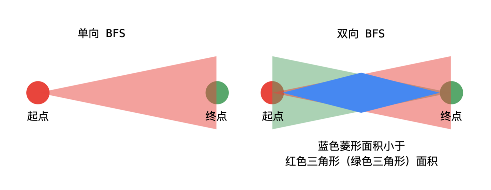

# 第一周

## 数据结构

### 1. 按存储结构

#### 顺序存储：数组

#### 链式存储：链表，跳表

1. skip list提升链表的访问效率（log n），但牺牲了维护成本，增删改都要维护索引；
2. redis使用skip list实现，**学习redis源码**

#### 实战题目：

* [x] **LRU缓存**——*利用hash表和双向链表（手动实现双向链表）；或者手动实现LinkedHashmap*

* [x] 移动零——*双指针，x指针负责遍历，y指针负责定位最靠前的0值点，每次x遍历到的非零值与y值替换；*

* [x] 盛水最多容器——*双指针，头尾中间靠拢，合理牺牲宽度换取高度*
* [x] 爬楼梯——*递归重复访问严重，效率极低，考虑递归时将历史结果缓存到数组中，或直接使用一重循环，每次遍历将结果保存；*
* [ ] **3数之和**
* [ ] 环形链表

### 2. 按逻辑结构-线性

#### 栈 

1. O(1)出入栈
2. 分析Stack源码（核心方法push(E item)/pop()/peek()）：

#### 队列 

1. O(1)出入队列；
2. **双端队列Deque**，头尾均可出入队；
3. 分析Queue（具体分析Deque的实现）源码（核心方法）；
4. **优先队列PriorityQueue**，取出按优先级获取；可用于实现获取第K大的元素的数据结构

#### 实战题目

* [ ] 有效的括号
* [ ] 最小栈

#### 课后练习：分析Queue及实现类PriorityQueue源码

##### Queue （Interface）

1. **定义** 

Queue是jdk1.5新增的数据结构，根据文档中的定义：

* * *

`
A collection designed for holding elements prior to processing. Besides basic Collection operations, queues provide additional insertion, extraction, and inspection operations. 
`

* * *

Queue是Collection的一种，与Set、List的区别在于Queue主要用于存储数据，而不是处理数据。在，Queue提供了额外的插入、删除、查询操作。

2. **API**

Queue定义了增删查三种操作，每种操作都有两种形式，一种在操作失败时抛出异常，另一种返回特殊值：

|      | 抛出异常  | 返回特殊值 |
| ---- | --------- | ---------- |
| 插入 | add(e)    | offer(e)   |
| 删除 | remove()  | poll()     |
| 查询 | element() | peek()     |

offer(e)是插入一个元素，插入失败返回false，用于一些正常情况可能插入失败的场景，比如有边界的queue；
remove()和poll()都是删除并返回队列的头部元素，删除哪个取决于队列中元素的排列顺序，跟具体实现有关；队列为空时poll()返回null；
element()和peek()只返回队列头部元素，但不删除；
*Queue中未定义并发编程所需的阻塞队列相关api，比如等待元素可见或等待队列空间可用，都在子类接口BlockingQueue中进行实现，此处不作分析*

##### PriorityQueue (C)

1. **定义**

根据文档中的定义：

* * *

`An unbounded priority queue based on a priority heap. The elements of the priority queue are ordered according to their natural ordering, or by a Comparator provided at queue construction time, depending on which constructor is used. A priority queue does not permit null elements. A priority queue relying on natural ordering also does not permit insertion of non-comparable objects (doing so may result in ClassCastException).`

* * *

PriorityQueue是基于优先级堆实现的无界优先级队列。队列中的元素根据自然顺序排序，或者通过构造时提供的比较器来排序。队列中不可插入空元素，同样也不能插入不可比较的对象（ClassCastException）

* * *

`The head of this queue is the least element with respect to the specified ordering. If multiple elements are tied for least value, the head is one of those elements -- ties are broken arbitrarily. The queue retrieval operations poll, remove, peek, and element access the element at the head of the queue.`

* * *

队列头部是与指定顺序相关的最小元素。队列的检索操作（删除、查询）都是从头部元素开始的。
队列虽无界但也有容量，容量会随着元素插入自动增长。（Arrays.copyOf(queue, newCapacity);）
PriorityQueue不是线程同步的，对应的有线程安全的PriorityBlockingQueue；

2. **成员属性**

PriorityQueue中定义的成员属性如下：

```
//队列的默认初始容量
private static final int DEFAULT_INITIAL_CAPACITY = 11；

/**
* 优先级队列内部使用数组来存储元素
* 实际上，此数组使用了堆排序的方式构建小根堆，使队列的头部总是最小的元素
**/
transient Object[] queue; 

//队列中的元素个数
private int size = 0;

//元素排序使用的比较器，如果comparator为null，则使用自然排序
private final Comparator<? super E> comparator;

//记录队列结构修改的次数，当队列中有元素插入、移除或者删除时，队列的结构会发生变化
transient int modCount = 0; 

//数组的最大长度
private static final int MAX_ARRAY_SIZE = Integer.MAX_VALUE - 8;
```

3. **构造方法**

类中提供了7种方式来构造优先队列，初始容量、比较器、给定集合（或给定优先队列、给定SortedSet）均可以在构造时进行指定，详见构造器的源码

4. **成员方法**
   因为优先队列是基于优先级堆实现的，所以相较于普通队列，其核心操作在于根据比较器进行最小堆的调整。
   PriorityQueue的成员方法包括下面三类：

* 插入方法
  提供了add(E e),offer(E e)两个方法，实际前者也直接调用了后者

```
/**
 * Inserts the specified element into this priority queue.
 */
public boolean add(E e) {
    return offer(e);
}

/**
 * Inserts the specified element into this priority queue.
 */
public boolean offer(E e) {
    if (e == null)
        throw new NullPointerException();
    modCount++;
    int i = size;
    if (i >= queue.length)
        //扩容
        grow(i + 1);
    size = i + 1;
    if (i == 0)
        queue[0] = e;
    else
        //将e放在数组的最后一个位置，向上调整最小堆queue[]，具体实现后面详述；
        siftUp(i, e);
    return true;
}
```

* 移除方法
  PriorityQueue的移除操作提供了poll(),remove(Object o),removeEq(Object o)
  poll()移除队列头部元素，若队列为空直接返回null；
  remove(Object o)若队列中个存在给定的元素o，通过for循环确定o的下表然后删除，该方法是public的
  removeEq(Object o)该方法是default只能再同包的类中使用，主要供PriorityQueue的迭代器调用

```
//移除队列头部元素
public E poll() {
    if (size == 0)
        return null;
    int s = --size;
    modCount++;
    E result = (E) queue[0];
    E x = (E) queue[s];
    queue[s] = null;
    if (s != 0)
        //将末尾元素取出，从头部向下调整最小堆
        siftDown(0, x);
    return result;
}

/**
 * Removes a single instance of the specified element from this queue,
 */
public boolean remove(Object o) {
    int i = indexOf(o);
    //不存在直接返回
    if (i == -1)
        return false;
    else {
        //从队列中删除元素o，具体实现后述
        removeAt(i);
        return true;
    }
}

/**
 * Version of remove using reference equality, not equals.
 * Needed by iterator.remove.
 */
boolean removeEq(Object o) {
    //通过遍历的方式删除可能存在的指定元素
    for (int i = 0; i < size; i++) {
        if (o == queue[i]) {
            removeAt(i);
            return true;
        }
    }
    return false;
}
```

* 公共方法
  公共方法中主要的有如下几个
  通过Collection进行构造有限队列的方法：

```
//通过给定的优先级队列进行构造
private void initFromPriorityQueue(PriorityQueue<? extends E> c) {
    if (c.getClass() == PriorityQueue.class) {
        this.queue = c.toArray();
        this.size = c.size();
    } else {
        initFromCollection(c);
    }
}

//给定集合中的元素进行构造（无堆排序部分，若传入的非sortedSet，在heapify()中进行堆排序）
private void initElementsFromCollection(Collection<? extends E> c) {
    Object[] a = c.toArray();
    // If c.toArray incorrectly doesn't return Object[], copy it.
    // 若返回的不是数组，则复制
    if (a.getClass() != Object[].class)
        a = Arrays.copyOf(a, a.length, Object[].class);
    int len = a.length;
    if (len == 1 || this.comparator != null)
        for (int i = 0; i < len; i++)
            if (a[i] == null)
                throw new NullPointerException();
    this.queue = a;
    this.size = a.length;
}

//给定非sortedSet元素进行构造
private void initFromCollection(Collection<? extends E> c) {
    initElementsFromCollection(c);
    //向下构建最小堆（堆排序）
    heapify();
}
```

向上、向下的堆排序（构造最小堆）

```
//自然排序从k节点向上构造
private void siftUpComparable(int k, E x) {
    Comparable<? super E> key = (Comparable<? super E>) x;
    while (k > 0) {
        //计算第k个节点的父节点下标
        int parent = (k - 1) >>> 1;
        Object e = queue[parent];
        //如果x大于第k个节点的父节点，说明已是最小堆，跳出循环
        if (key.compareTo((E) e) >= 0)
            break;
        //交换k节点与父节点元素
        queue[k] = e;
        k = parent;
    }
    //将元素x放在第k个节点位置
    queue[k] = key;
}
//使用比较器向上构造
private void siftUpUsingComparator(int k, E x) {
    while (k > 0) {
        int parent = (k - 1) >>> 1;
        Object e = queue[parent];
        if (comparator.compare(x, (E) e) >= 0)
            break;
        queue[k] = e;
        k = parent;
    }
    queue[k] = x;
}

//自然排序向下构造
private void siftDownComparable(int k, E x) {
    Comparable<? super E> key = (Comparable<? super E>)x;
    int half = size >>> 1;        // loop while a non-leaf
    while (k < half) {
        //计算第k个节点的左孩子节点下标，为2k+1
        int child = (k << 1) + 1; // assume left child is least
        Object c = queue[child];
        //计算第k个节点的右孩子节点下标，为2k+2
        int right = child + 1;
        //获取左右孩子的最小节点
        if (right < size &&
            ((Comparable<? super E>) c).compareTo((E) queue[right]) > 0)
            c = queue[child = right];
        //若key小于c说明已经是最小堆，跳出
        if (key.compareTo((E) c) <= 0)
            break;
        //左右子节点中最小的节点放在第k个节点位置，
        queue[k] = c;
        k = child;
    }
    //将元素x放在第k个节点位置
    queue[k] = key;
}
//使用比较器向下构造
private void siftDownUsingComparator(int k, E x) {
    int half = size >>> 1;
    while (k < half) {
        int child = (k << 1) + 1;
        Object c = queue[child];
        int right = child + 1;
        if (right < size &&
            comparator.compare((E) c, (E) queue[right]) > 0)
            c = queue[child = right];
        if (comparator.compare(x, (E) c) <= 0)
            break;
        queue[k] = c;
        k = child;
    }
    queue[k] = x;
}
```

根据给定下标删除元素

```
private E removeAt(int i) {
    // assert i >= 0 && i < size;
    modCount++;
    int s = --size;
    if (s == i) // removed last element
        queue[i] = null;
    else {
        E moved = (E) queue[s];
        queue[s] = null;
        siftDown(i, moved);
        //数组最后一个元素被直接移动到了被删除元素的位置时，重新向上调整
        if (queue[i] == moved) {
            siftUp(i, moved);
            if (queue[i] != moved)
                return moved;
        }
    }
    return null;
}
```

将队列序列化至输出流中；输入流中反序列化出队列，此处贴出源码，不具体分析

```
private void writeObject(java.io.ObjectOutputStream s)
    throws java.io.IOException {
    // Write out element count, and any hidden stuff
    s.defaultWriteObject();

    // Write out array length, for compatibility with 1.5 version
    s.writeInt(Math.max(2, size + 1));

    // Write out all elements in the "proper order".
    for (int i = 0; i < size; i++)
        s.writeObject(queue[i]);
}

private void readObject(java.io.ObjectInputStream s)
    throws java.io.IOException, ClassNotFoundException {
    // Read in size, and any hidden stuff
    s.defaultReadObject();

    // Read in (and discard) array length
    s.readInt();

    SharedSecrets.getJavaOISAccess().checkArray(s, Object[].class, size);
    queue = new Object[size];

    // Read in all elements.
    for (int i = 0; i < size; i++)
        queue[i] = s.readObject();

    // Elements are guaranteed to be in "proper order", but the
    // spec has never explained what that might be.
    heapify();
}
```

总结来说：

* PriorityQueue是无界的，不限制容量
* PriorityQueue不允许插入空元素，如有比较器，插入元素按比较器排序，否则按自然顺序
* PriorityQueue线程不安全
* PriorityQueue优先级是借助内部数组的堆排序实现的，任何的插入删除操作，会进行堆调整以重新构建最小堆，所以插入删除时间复杂度均为O(log n)

# 第二周

## 集合（Collection）/映射（Map）/哈希表（Hash table）
### 哈希表Hash table
- 也叫做散列表 根据key进行直接访问的数据结构
- key映射到表中的位置，可以加快访问速度
- 映射函数叫做散列函数，存放的数组叫哈希表

#### 工程实践
- 电话号码簿
- 用户信息表
- 缓存（LRU缓存等）
- **键值对存储（Redis）**（分析具体实现）

### 实战题目
- [x] 有效异位词比较
- [x] 有效异位词分组
- [x] 两数之和

## 树/二叉树
### 二叉树
#### 遍历
- 前序：根左右
- 中序：左根右
- 后序：左右根

#### 完全二叉树
- 除了最后一层，其他层均满节点

#### 满二叉树
- 特殊的二叉树，所有层均满节点

### 二叉搜索树
- 左子树上的所有节点值均小于它的根节点值
- 右子树上的所有节点值均大于它的根节点值
- 重复性：左右子树也都是二叉搜索树
- 其中序遍历就是升序遍历

### 实战题目
- [x] 二叉树的前中后序遍历
- [x] N叉树的前后序遍历
- [x] N叉树的层序遍历

## 堆Heap/二叉堆Binary Heap
### 堆
- 可以迅速找到一堆数中最大或者最小值的数据结构
- 分为大顶堆、小顶堆
- 常见的有二叉堆、斐波那契堆
- 就大顶堆而言：
    -   find-max ：O(1)
    -   delete-max：O(logN)
    -   insert(create):O(logN) or O(1)

### 二叉堆
- 属于完全二叉树
- 任意节点的值>=or<=子节点的值
- 一般都通过数组来实现，若第一个元素索引为0
    - 索引i的左孩子索引是2i+1;
    - 索引i的右孩子索引是2i+2;
    - 索引i的父结点索引是floor((i-1)/2);
- 插入操作时，向上调整堆 O(logN)
- 删除操作时，末尾替代到0元素，向下调整堆 O(logN)

### 实战题目
- [ ] 滑动窗口最大值
- [ ] 前k个高频元素
- [ ] 最小的k个数
- [ ] 丑数

## 图
### 属性
- Graph（V，E）
- V-vertex:点
    - 度 - 入度和出度
    - 点与点之间：联通与否
- E-edge 边
    - 有向和无向
    - 权重（边长）

### 分类
- 无向无权图
- 有向无权图
- 无向有权图
- 有向有权图

### 基于图的算法
#### DFS-递归写法
```
visited = set() # 和树中的DFS最大区别
def dfs(node, visited):
    if node in visited: # terminator
        # already visited
        return
        
    visited.add(node)

    # process current node here.
    ...
    for next_node in node.children(): 
        if not next_node in visited:
            dfs(next_node, visited)
```
#### BFS
```
def BFS(graph, start, end): 
    queue = []
    queue.append([start])

    visited = set() # 和数中的BFS的最大区别

    while queue:
        node = queue.pop() 
        visited.add(node)
        
        process(node)
        nodes = generate_related_nodes(node) queue.push(nodes)
```
### 图的高级算法
- [ ] [连通图个数](https://leetcode-cn.com/problems/number-of-islands/)
- [ ] [拓扑排序](https://zhuanlan.zhihu.com/p/34871092)
- [ ] [最短路径](https://www.bilibili.com/video/av25829980?from=search&seid=13391343514095937158)
- [ ] [最小生成树](https://www.bilibili.com/video/av84820276?from=search&seid=17476598104352152051)

## 本周小总结：HashMap源码解析（待完善）

### 概述
1. 根据jdk官方文档的说明，hashmap是基于散列表，对map接口的一种实现，数据结构是“链表散列”，即数组+链表，底层是基于散列算法实现。
2. key唯一，value可重复，允许null键与null值，元素是无序的。
3. HashMap继承自抽象类AbstractMap，实现了Map接口，Map接口规范了作为一个key-value类应该具有的基本api，比如**get(),put(),remove()**，以及用来管理内部数据的视图**keySet(),values(),entrySet()**。同时还定义用于抽象key-value的Entry接口。
    - JDK1.8开始，通过关键字default，Map接口中也提供了一些方法的默认实现。
4. 需要注意的是，hashmap非线程安全，多线程环境易出现问题。
5. 本篇源码分析主要针对**jdk1.8版本**，其相较于之前版本的主要不同之处会略有提及。

### 主要变量
- 用于存储<key,value>节点的表，也称作桶，第一次初始化后，有必要会扩容，容量保持为2的指数
```java
transient Node<K,V>[] table;
```
- 同时封装了keySet和values的视图，作用类似AbstractMap中的keySet + values
```java
transient Set<Map.Entry<K,V>> entrySet;
```
- 容器中实际存放的Node数量
```java
transient int size;
```
- HashMap在结构上被修改的次数，包括改变hashmap中的映射，或者其他方式比如rehash；
此字段用于使hashmap集合视图上的迭代器失效ConcurrentModificationException
```java
transient int modCount;
```
- 下一个需要扩容的阈值，=capacity*loadFactor， 这里的capacity就是当前的buckets容量大小，一般情况是table数组的大小。
```java
int threshold;
```
- 装载因子，buckets被填满的比例。主要是为了计算得到threshold。
```java
final float loadFactor;
```

### 代码分析
- HashMap的主要操作中，按照基本的顺序，可参考如下时序图：

  


- 根据时序图的顺序，逐步分析主要api。

### 主要api
#### 1. 初始化-构造方法
初始化，也就是HashMap的构造方法
- 默认构造：

```java
/**
* 构造一个空的 HashMap，其 capacity 默认为 16，load factor 默认为 0.75
*/
public HashMap() {
    this.loadFactor = DEFAULT_LOAD_FACTOR; 
}
```
- 重载构造

```java
/**
* 指定 capacity 大小，但 load factor 默认为 0.75
*/
public HashMap(int initialCapacity) {
        this(initialCapacity, DEFAULT_LOAD_FACTOR);
}
/**
* 同时指定 capacity 和 load factor 的大小，并且同时计算出 threshold 的值 
*/
public HashMap(int initialCapacity, float loadFactor) {
    if (initialCapacity < 0)
        throw new IllegalArgumentException("Illegal initial capacity: " +
                                           initialCapacity);
    if (initialCapacity > MAXIMUM_CAPACITY)
        initialCapacity = MAXIMUM_CAPACITY;
    if (loadFactor <= 0 || Float.isNaN(loadFactor))
        throw new IllegalArgumentException("Illegal load factor: " +
                                           loadFactor);
    this.loadFactor = loadFactor;
    // 相比jdk1.7有算法优化：约束 threshold 的大小应该为 2 的 n 次幂 
    this.threshold = tableSizeFor(initialCapacity);
}
```
- 此处threshold大小约束的实现稍后详述。
- 根据以上的构造实现，就实际的场景下，**如能预期其大小或者预期未来的变化率，最好在初始化时就指定capacity和和loadFactor，就能有效减少内存的分配和扩容的开销，提升使用效率。**

#### 2. 插入-put(k,v)方法
```java
/**
* 使 key 和 value 产生关联，但如果有相同的 key 则新的会替换掉旧的
*/
public V put(K key, V value) {
    return putVal(hash(key), key, value, false, true);
}
```

put方法在这里做了两步操作，一个是调用哈希函数hash(key) 计算key对应的hash码，然后进一步调用putVal方法；这里先看hash(key)：

```java
static final int hash(Object key) {
    int h;
  	// 如果key为null，返回的就是0，否则就是hashCode异或其无符号位右移16位的结果
    return (key == null) ? 0 : (h = key.hashCode()) ^ (h >>> 16);
}
```

根据注释的hash值计算方法，得到的结果就是hashCode高16位不变，低16位于高16位做一个异或。**其目的是同时把高16位和低16位的影响都考虑进来，尽量减少HashMap的哈希冲突。**
当然也与HashMap计算散列后的index方法有关，在putVal中有：

```java
i = (n-1) & hash
```


#### 3. 遍历-entrySet()方法

#### 4. get()

#### 5. remove()


### 总结
#### 1. 

#### 2. 

#### 3.

#### 4. HashMap与HashTable
#### 5. HashMap与ConCurrentHashMap


# 第三周
## 泛型递归/树的递归 Recursion
### 递归的实现
1. 递归的本质就是循环，只是通过函数体来进行循环
2. 代码实现
``` java
public void recur(int val, int param) {
    //1. terminator
    if(level>MAX_LEVEL) {
        //process result
        return;
    }
    
    //2. process current logic
    process(level, param);
    //3. drill down
    recur(level+1, newParam);
    
    //4. restore current status if needed.
}
```

3. 经典题：

   [二叉树的最大深度](https://leetcode-cn.com/problems/maximum-depth-of-binary-tree/)

   题解：

   ```java
   class Solution {
       public int maxDepth(TreeNode root) {
           //递归 子树的层数+1；
           if (root == null) return 0;
         	int left = maxDepth(root.left); //左子树的最大深度
         	int right = masDepth(root.right); //右子树的最大深度
           return Math.max(left,right) + 1;
       }
   }
   ```

   [二叉树的最小深度](https://leetcode-cn.com/problems/minimum-depth-of-binary-tree/)

   题解:

   ```java
   class Solution {
       public int minDepth(TreeNode root) {
           //递归 注意这里的最小深度是从根节点到最近叶子节点的最短路径上的节点数量。
           // 叶子节点是指左右子节点都为空的情况 若有左无右或者有右无左，都不算叶子节点。
           if (root == null) return 0;
           int left = minDepth(root.left);
           int right = minDepth(root.right);
           return (root.left != null && root.right != null) ? Math.min(left,right) + 1 : Math.max(left,right) + 1;
       }
   }
   ```

   

### 递归的特性

- 有一个明确的结束条件
- 每次进入下一层时，问题规模相比上一次会减小
- 若递归存在分支，会导致效率低下甚至栈溢出

### 递归的思维要点
- 找最近重复性
- 避免人肉递归
- 数学归纳法思维

### 相关习题：
- [x] 爬楼梯
- [x] 括号生成
- [ ] 反转二叉树
- [ ] 验证二叉搜索树
- [x] 二叉树的最大深度
- [x] 二叉树的最小深度
- [ ] 二叉树的序列化与反序列化


## 分治/回溯
### 分治算法特性
- 分治算法就是将原问题划分成n个规模较小，结构与原问题相似的子问题；
- 一般是通过递归来解决子问题，然后合并结果
- 但凡能够使用数学归纳法解决的问题，都可以使用分治的思想
- 分治思想也不一定使用递归结构

### 分治算法实现模板
1. 代码模板
``` python
# Python
def divide_conquer(problem, param1, param2, ...): 
  # recursion terminator 
  if problem is None: 
	print_result 
	return 
  # prepare data 
  data = prepare_data(problem) 
  subproblems = split_problem(problem, data) 
  # conquer subproblems 
  subresult1 = self.divide_conquer(subproblems[0], p1, ...) 
  subresult2 = self.divide_conquer(subproblems[1], p1, ...) 
  subresult3 = self.divide_conquer(subproblems[2], p1, ...) 
  …
  # process and generate the final result 
  result = process_result(subresult1, subresult2, subresult3, …)
	
  # revert the current level states
```
2. 经典题：[括号生成](https://leetcode-cn.com/problems/generate-parentheses/)

   - 描述：

     数字 *n* 代表生成括号的对数，请你设计一个函数，用于能够生成所有可能的并且 **有效的** 括号组合。

   - 题解：

     ```java
     class Solution {
         List<String> result = new ArrayList<>();
         public List<String> generateParenthesis(int n) {
             // 抽象成2n个格子 放入左右括号，合法的可能性
             // 第一步 先写函数 ，n指剩余的左右括号数量，s表示有效的答案
             _generate(n, n, "");
             return result;
         }
     
         private void _generate(int left, int right, String s) {
             //terminate
             if (left == 0 && right == 0) {
                 result.add(s);// combine前提
                 return;
             }
             // process logic 保证左括号不能超过n个，左括号个数>右括号
             // drill down
             if (left > 0) {
                 _generate(left -1, right, s + '(');
             }
             if (left < right ) {
                 _generate(left, right -1, s + ')');
             }
             // reverse status
         }
     }
     ```

3. 回溯经典题： 全排列

   ```java
   class Solution {
       List<List<Integer>> result = new ArrayList<>();
       public List<List<Integer>> permute(int[] nums) {
           if (nums.length == 0) return result;
           dfs(nums.length, nums, new ArrayList<>(), new int[nums.length]);
           return result;
       }
       //回溯思想：每次选择一个元素，回溯后再下一次遍历，tags标记已添加过的元素，进入下一次选择，一共选择nums.length次
       private void dfs(int capacity, int[] nums, List<Integer> res , int[] tags) {
           //terminator
           if (capacity == 0) {
               result.add(new ArrayList<>(res));
               return;
           }
           for (int i = 0; i < nums.length; i++) { //process & drill down
               if (tags[i] == 1) continue; //判断是否已添加过
               tags[i] = 1;
               res.add(nums[i]);
               dfs(capacity-1, nums, res, tags);
               tags[i] = 0;  // backtrace
               res.remove(res.size()-1);
           }
       }
   }
   ```

   

### 回溯算法特性

- 尝试法试错
- 通常也是用最简单的递归方式实现
- 找到可能存在的一个或者多个答案
- 最坏的情况下，回溯算法可能导致复杂度为指数时间的计算
- 代码模板类似递归

### 相关习题
1. 分治
- [x] 括号生成
- [x] Pow(x, n) 
- [x] [子集](https://leetcode-cn.com/problems/subsets/)
- [x] [电话号码的字母组合](https://leetcode-cn.com/problems/letter-combinations-of-a-phone-number/)
- [x] [多数元素](https://leetcode-cn.com/problems/majority-element/)

2. 回溯
- [ ] N皇后问题
- [ ] 数独


### 附加：牛顿迭代法
1. **牛顿迭代法快速寻找平方根**
下面这种方法可以很有效地求出根号a的近似值：首先随便猜一个近似值x，然后不断令x等于x和a/x的平均数，迭代个六七次后x的值就已经相当精确了。例如，我想求根号2等于多少。假如我猜测的结果为4，虽然错的离谱，但你可以看到使用牛顿迭代法后这个值很快就趋近于根号2了：

- (       4  + 2/   4     ) / 2 = 2.25
- (    2.25  + 2/   2.25  ) / 2 = 1.56944..
- ( 1.56944..+ 2/1.56944..) / 2 = 1.42189..
- ( 1.42189..+ 2/1.42189..) / 2 = 1.41423..
….
       
    这种算法的原理很简单，我们仅仅是不断用(x,f(x))的切线来逼近方程x^2 - a=0的根。根号a实际上就是x^ 2-a=0 的一个正实根，这个函数的导数是2x。 也就是说，函数上任一点(x,f(x))处的切线斜率是2x。那么，x-f(x)/(2x)就是一个比x更接近的近似值。代入f(x)=x^2 - a得到x-(x^2 - a)/(2x)，也就是(x+a/x)/2。
    同样的方法可以用在其它的近似值计算中。

2. 代码：
``` java
int mysqrt(int x){
	double tmpx = x;
	double k = 1.0;
	double k0 = 0.0;
	while(abs(k0-k) >= 1){
		k0 = k;
		k = (k + tmpx/k)/2;
	}
	return (int)k;
}
```

### 周作业题：
- [x] 二叉树最近公共祖先
- [x] 从前序中序遍历构造二叉树
- [x] 组合
- [x] 全排列
- [x] 全排列II


# 第四周
### DFS深度优先搜索
#### 特性
- 属于一种树/图搜索算法
- 只要产生新的节点，就先进行扩展，深入其中，直取结果；
- 能找出所有解决方案
- 缺点：1. 多次遍历搜索可能路径时，标识需要取消；2.深度很大的情况下 效率不够高

#### 代码实现
递归模板：以二叉树的前序遍历为例
``` java
visited = set()
private void dfs(node) {
    if (node == null) {
        return;
    }
    visited.add(node);
    dfs(node.left);
    dfs(node.right);
}
```
迭代模板
``` java
private void dfs(node) {
    if (node == null) {
        return [];
    }
    visited = set() , stack = stack();
    stack.add(node);
    while (!stack.isEmpty()) {
        node = stack.pop();
        visited.add(node);
        process(node);
        nodes = generate_related_nodes(node);
        stack.push(nodes);
    }
}
```

### BFS广度优先搜索
#### 特性
- 树/图搜索算法的一种
- 对于解决最短或最少问题更有优势；
- 优化：双向广度优先算法
- 缺点：内存开销较大，需要不断存储访问状态


#### 代码实现
``` java
private void bfs(node) {
    queue = new LinkedList();
    queue.add(node);
    while (queue not null){
        //若需要先处理一层的元素，进行状态维护，增加一层对queue当前大小的循环遍历
        node = queue.pop();
        visited.add(node);
        process(node);
        nodes = generate_related_nodes(node);
        queue.push(nodes);
    }
}
```

#### 练习题
- [x] 二叉树的层序遍历
- [ ] 最小基因变化
- [x] 括号生成
- [ ] 寻找每个树行中的最大值

### 贪心算法
#### 特性
- 一般用于解决一些最优化问题
- 高效性

#### 适用场景
- 图中的最小生成树 、 哈夫曼编码 、 
- 问题能够分解成子问题，且子问题最优解能够递推到最终问题的最优解 （最优子结构）
- 其余动态规划的不同在于贪心对每个子问题都做出了选择并不能回退；动态规划会保存以前的每个运算结果，并根据以前的结果对当前进行选择，有回退功能；

#### 实战练习题：均在作业题中出现
- [x] 柠檬水找零
- [x] 买卖股票最佳时机II
- [x] 分发饼干
- [x] 模拟行走机器人
- [x] 跳跃游戏
- [ ] 跳跃游戏II

### 二分查找
#### 特性
- 目标函数的单调性
- 上下界
- 索引访问（数组）

#### 代码实现
``` java
left, right = 0, length - 1
while left<=right {
    mid = left + (right - left >> 1)
    if (array[mid] == target) {
        # find the target
        break or return result;
    }
    else if (array[mid] < target) left = mid + 1;
    else right = mid - 1; 
}
```

#### 实战练习题
- [ ] x的平方根
- [ ] 有效的完全平方数
- [x] 搜索旋转排序述组
- [x] 搜索二维矩阵
- [x] 寻找旋转排序树组中的最小值

#### 附件题 
使用二分查找，寻找一个旋转排序数组 [4, 5, 6, 7, 0, 1, 2] 中间无序的地方（返回下标）
注：数组中不存在重复元素

``` java
public int getDisorderIndex(int[] nums) {
    int n = nums.length
    if (n <= 1) return -1;
    int left = 0, right = n - 1;
    while (left < right) { //二分循环，left和right相遇之前跳出
        int mid = left + (right - left >> 1);
        if (nums[mid] < nums[right]) {
            if (nums[mid] < nums[mid-1]) return mid; //去掉有序部分之前，先判断边界点是否为转换点
            right = mid - 1;
        }
        else {
            if (nums[mid] > nums[mid+1]) return mid + 1; //去掉有序部分之前，先判断边界点是否为转换点
            left = mid + 1;   
        }
    }
    return -1;
}
```

### 周作业题
简单
- [x] 柠檬水找零
- [x] 买卖股票最佳时机II
- [x] 分发饼干
- [x] 模拟行走机器人

中等
- [x] 单次接龙
- [x] 岛屿数量
- [x] 扫雷游戏
- [x] 跳跃游戏
- [x] 搜索旋转排序数组
- [x] 搜索二维矩阵
- [x] 寻找旋转排序数组中的最小值

困难
- [ ] 单次接龙II
- [ ] 跳跃游戏II

# 第六周
### 动态规划
#### 本质
将复杂问题分解成子问题，寻找其重复性；

#### 定义
多阶段决策问题中,各个阶段采取的决策,一般来说是与时间有关的,决策依赖于当前状态,又随即引起状态的转移,一个决策序列就是在变化的状态中产生出来的,故有“动态”的含义,称这种解决多阶段决策最优化问题的方法为动态规划方法

#### 相关概念
【无后效性】
- 一旦f(n)确定，“我们如何凑出f(n)”就再也用不着了。
- 要求出f(15)，只需要知道f(14),f(10),f(4)的值，而f(14),f(10),f(4)是如何算出来的，对之后的问题没有影响
- “未来与过去无关”，这就是无后效性。
- 严格定义：如果给定某一阶段的状态，则在这一阶段以后过程的发展不受这阶段以前各段状态的影响。

【最优子结构】
- 大问题的最优解可以由小问题的最优解推出，这个性质叫做“最优子结构性质”。

所以动态规划的推理即：能将大问题拆成几个小问题，且满足无后效性、最优子结构性质。

#### 典型应用
- DAG最短路
如图，求S-T的最少开销；


不难看出，f(T) = min (f(C)+20, f(D)+10);
也就是F(P) = min{F(D) + V (D->P)};

#### DP三连
我是谁？——设计状态，表示局面

我从哪里来？

我要到哪里去？ ——设计转移

#### 练习题
- [ ] 最长公共子序列
- [ ] 最长上升子序列
- [x] 零钱兑换
- [x] 最大子序列的和
- [x] 三角形最小路径和
- [x] 打家劫舍
- [x] 打家劫舍II
- [x] 打家劫舍III

#### 作业题
中等

- [x] 最小路径和
- [ ] 解码方法
- [ ] 最大正方形
- [ ] 任务调度器
- [ ] 回文子串

困难

- [ ] 最长有效括号
- [ ] 编辑距离
- [ ] 矩形区域内不超过k的最大数值和
- [ ] 青蛙过河
- [ ] 分割数组的最大值
- [ ] 学生出勤记录
- [ ] 最小覆盖子串
- [x] 戳气球


# 第七周
## 字典树

### 数据结构
#### 图示

#### 代码实现
```java
class Trie {
    private TreeNode root;
    public Trie() {this.root = new TreeNode();}
    public void insert(String word){/*...*/}
    public boolean search(String target){/*...*/}
    public boolean startWith(String prefix){/*...*/}

    class TreeNode {
        final int SIZE = 26;
        boolean isEnd;
        TreeNode[] childs; 
        public TreeNode() {
            this.isEnd = false;
            this.childs = new TreeNode[SIZE];
        }
    }
}
```
### 基本性质
1. 结点本身不存完整的单词
2. 根结点到某一结点经过的字符连接成对应字符串
3. 每个结点所有子结点代表的字符都不同
### 典型例题
- [x] 单词搜索II
- [x] 实现Trie前缀树

## 并查集
### 数据结构
#### 图示

#### 代码实现
```java
class Unions {
    private int count;
    private int[] parent;
    public Unions(int n) {
        count = n;
        parent = new int[n];
        for (int i = 0; i < n; i++) parent[i] = i;
    }
    public void union(int x, int y) {
        int rootX = find(x);
        int rootY = find(y);
        if (rootX == rootY) return;
        parent[rootX] = rootY;
        count--;
    }
    public int find(int x) {
        while (x != parent[x]) {
            parent[x] = parent[parent[x]]; //路径压缩
            x = parent[x];
        }
        return x;
    }
    public int count() { return count;}
}
```
#### 结构优化
1. 路径压缩
2. rank数组判断深度决定union方向（有路径压缩可省去）
### 基本操作
1. makeSets(n) 构造一个初始大小为n的并查集
2. union(x, y) 将x和y两个元素连接，即一个元素的root指向另一个元素的root
3. find(x) 找到某元素x的root
### 典型例题
- [x] 朋友圈
- [x] 岛屿问题

## 高级搜索
### dfs与bfs的剪枝
#### 特点与特性
1. 棋类常用剪枝
2. 在bfs与dfs的基础上，避免重复或者无意义访问的优化动作

#### 典型例题
- [x] 斐波那契
- [ ] 数独

### 双向bfs
#### 特点与特性

#### 代码模板
```java
class Model {
  public void model() {
    //1.init
    Set<String> visit = new HashSet<>(); //总的访问记录 保证每个节点只被访问一次
    //3. 用两个visit分别表示起始节点和目标节点发起的bfs待访问节点集合；
    Set beginVisit = new HashSet<>();
    beginVisit.add(begin);
    Set endVisit = new HashSet<>();
    endVisit.add(end);
    int step = 1; //初始路径数
    while (!beginVisit.isEmpty() && !endVisit.isEmpty()) {
      //判断beginvisit和endvisit的大小，取小的进行下探
      if (beginVisit.size() > endVisit.size()) {
          Set temp = beginVisit;
          beginVisit = endVisit;
          endVisit = temp;
      }
      Set newBeginVisit = new HashSet<>();
      for (Object obj : beginVisit)  {
        Object newObj = handle(obj); //处理obj得到图的下一个访问节点
        if (endVisit.contains(newObj)) return step+1;
        if (!visit.contains(newObj)) {
          newBeginVisit.add(newObj);
          visit.add(newObj);
        }
      }
      beginVisit = newBeginVisit;
      step++;
    }
    return 0; // 其中一个集合为空，begin和end未相遇，则路径无法到达；
  }
}
```
#### 典型例题
- [ ] 单词拼接
- [ ] 单词拼接II

### A*启发式搜索
#### 特点与特性
1. 利用优先队列，对待访问的元素进行特定的排序，优先访问某些元素，以提高整体效率
2. 启发式函数h(n)，它用来评价哪些节点最值得优先访问
#### 典型例题
- [ ] 二进制矩阵中的最短路径
- [ ] 滑动谜题

## 红黑树与AVL数
### AVL数
1. 自平衡的二叉搜索树
2. 存储额外的平衡因子k, int k = height(left) - height(right)
3. 通过自旋操作，保证每个结点的平衡因子均在（-1，0，1）中

### 红黑树
1. 近似平衡的二叉搜索树
2. 通过结点的红黑性质，保证左右子树高度差小于两倍
3. 根结点与叶子结点均为黑；
4. 红色结点不能有相邻
5. 结点到子树中所有叶子结点的路径包含相同的黑色节点

### 优劣比较
1. **红黑树有更好的插入和删除效率，因为是近似平衡，有更少的旋转操作**；且存储只需要额外1bit区分红黑；
2. **AVL树有更高的查询效率，因为是严格平衡的二叉树**；但需要额外存储高度int信息，空间消耗与维护成本较高

## 作业题
- [x] 被围绕的区域
- [x] 有效的数独
- [x] 括号生成
- [x] 单词接龙
- [x] 最小基因变化
- [x] 单词搜索II
- [x] N皇后
- [x] 解数独


# 第八周
## 位运算
### 基本的位运算符
- '<<' 左移 乘2
- '>>' 右移 除2
- | 按位或 （有一则为1）
- & 按位与 （有0则为0）
- ~ 按位取反 （1为0 0为1）
- ^ 按位异或 （相同为0 不同为1）

#### 异或的一些特点：
- x ^ 0 = x
- x ^ 1s = ~x
- (x ^ ~x) = 1s and (x ^ x) = 0
- ^ 满足交换律结合律 

#### 指定位置的位运算
- 左边n位清零： x & (~0 << n)
- 获取x的第n位值： (x >> n) & 1
- 获取x的第n次幂： x & (1 << n)
- x的第n位替换为1： x | (1 << n)

#### 常用技巧：
- 判断奇偶： (x & 1) == 0 or 1
- 乘除2 >>1 <<1
- 清零最低位的1： x & (x - 1)
- 得到最低位的1： x & -x
### 经典题
- 10进制转2进制：递归除以2，余数拼接后，逆序
- [x] N皇后
- [x] N皇后II

## 布隆过滤器
### 核心实现
- 由一个超大的位数组和几个随机哈希函数实现；
- 添加元素操作：
    1. 将添加元素执行k个哈希函数得到k个哈希值
    2. 将位数组对应k个位置设为1
- 查找元素
    1. 将目标元素执行k个哈希函数得到k个哈希值
    2. 判断位数组这k个位置上是否均为1
    3. 若非均为1，则肯定不存在； 若均为1，**可能存在**
### 特点
- 空间效率和查询效率极高
- 有一定的误识别率
### 应用场景
- 比特币网络
- 分布式系统
- Redis缓存
- 垃圾邮件过滤

## LRU缓存
### 代码实现
- 此处给出一个常规实现：数组+双向链表
```java
class Solution {
  private HashMap<Integer, Node> map;
  private final int capacity;
  private Node head;
  private Node tail;
  // 初始化。注意：链表最好先定义头节点，双向链表先定义头尾节点；
  public LRUCache(int capacity) {
    this.capacity = capacity;
    map = new HashMap<>((int)(capacity / 0.75 + 1), 0.75f);
    head = new Node(0,0);
    tail = new Node(0,0);
    head.next = tail;
    tail.prev = head;
  }
  // 具体方法实现略 get时将返回的元素防止末尾；put时若超过容量需要将头部元素挤出
}
// 双向链表定义
class Node {
    int key;
    int value;
    Node prev;
    Node next;
    
    public Node(int key, int value) {
      this.key = key;
      this.value = value;
    }
} 
```

## 排序算法
### 快速排序实现
```java
class QuickSort{
  public static void quickSort(int[] nums, int begin, int end) {
    if (end <= begin) return;
    int pivot = partition(nums, begin, end);
    quickSort(nums, begin, pivot - 1);
    quickSort(nums, pivot + 1, end);
  }
    
  // 定义标杆位置的下标，划分后返回新的下标
  private static int partition(int[] nums, int begin, int end) {
    int pivot = end, count = begin;
    for (int i = begin; i < end; i++) {
      if (nums[i] < nums[pivot]) {
        swap(nums, i, count);
        count++;
      }
    }
    swap(nums, pivot, count);
    return count;
  }
  private static void swap(int[] nums, int i, int j) {
    int temp = nums[j];
    nums[j] = nums[i];
    nums[i] = temp;
  }
  public static void main(String[] args){
    int[] test = new int[]{2,4,1,4,7,8,3,5};
    quickSort(test, 0, 7);
  }
}
```

### 归并排序
```java
class MergeSort{
  public static void mergeSort(int[] nums, int left, int right) {
    if (right <= left) return;
    int mid = left + (right - left >> 1);
    mergeSort(nums, left, mid);
    mergeSort(nums, mid + 1, right);
    crossSort(nums, left, mid, right);
  }
  private static void crossSort(int[] nums, int left, int mid, int right) {
    int[] temp = new int[right - left + 1];
    int i = left, j = mid + 1, k = 0;
    while (i <= mid && j <= right) {
      if (nums[i] < nums[j]) temp[k++] = nums[i++];
      else temp[k++] = nums[j++];
    }
    while (i <= mid) temp[k++] = nums[i++];
    while (j <= right) temp[k++] = nums[j++];
    for (int m = 0; m < temp.length; m++) {
      nums[left + m] = temp[m];
    }
  }
}
```

### 例题
- [x] 翻转对
- [ ] 数组的相对排序
- [x] 合并区间

# 第九周
## 字符串匹配算法
### Rabin Karp RK算法
- 通过较好的hash函数，判断子串哈希是否相同；若相同再朴素算法一一匹配；
- 哈希函数利用滑动窗口，去头填尾来提升哈希效率（将滑动后的再哈希从O(m)降低到O(1)）；

### KMP算法
- 利用已知信息：pat字符串中出现的前缀串的匹配值；

- 动态地跳过部分确定不匹配的尝试步骤


### 本周作业
简单
- [ ] 字符串中的第一个唯一字符（亚马逊、微软、Facebook 在半年内面试中考过）
- [x] 反转字符串 II （亚马逊在半年内面试中考过）
- [x] 翻转字符串里的单词（微软、字节跳动、苹果在半年内面试中考过）
- [ ] 反转字符串中的单词 III （微软、字节跳动、华为在半年内面试中考过）
- [x] 仅仅反转字母（字节跳动在半年内面试中考过）
- [ ] 同构字符串（谷歌、亚马逊、微软在半年内面试中考过）
- [ ] 验证回文字符串 Ⅱ（Facebook 在半年内面试中常考）
中等

在学习总结中，写出不同路径 2 这道题目的状态转移方程。
- [x] 最长上升子序列（字节跳动、亚马逊、微软在半年内面试中考过）
- [x] 解码方法（字节跳动、亚马逊、Facebook 在半年内面试中考过）
- [x] 字符串转换整数 (atoi) （亚马逊、微软、Facebook 在半年内面试中考过）
- [ ] 找到字符串中所有字母异位词（Facebook 在半年内面试中常考）
- [x] 最长回文子串（亚马逊、字节跳动、华为在半年内面试中常考）
困难

- [x] 最长有效括号（亚马逊、字节跳动、华为在半年内面试中考过）
- [ ] 赛车（谷歌在半年内面试中考过）
- [ ] 通配符匹配（Facebook、微软、字节跳动在半年内面试中考过）
- [x] 不同的子序列（MathWorks 在半年内面试中考过）
