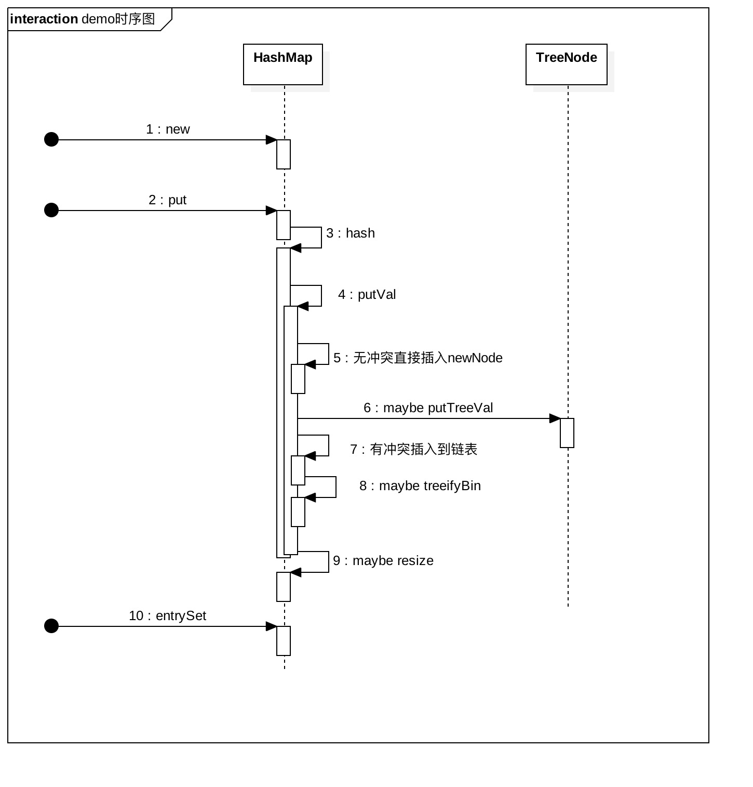

# 第二周

## 集合（Collection）/映射（Map）/哈希表（Hash table）
### 哈希表Hash table
- 也叫做散列表 根据key进行直接访问的数据结构
- key映射到表中的位置，可以加快访问速度
- 映射函数叫做散列函数，存放的数组叫哈希表

#### 工程实践
- 电话号码簿
- 用户信息表
- 缓存（LRU缓存等）
- **键值对存储（Redis）**（分析具体实现）

### 实战题目
- [x] 有效异位词比较
- [x] 有效异位词分组
- [x] 两数之和

## 树/二叉树
### 二叉树
#### 遍历
- 前序：根左右
- 中序：左根右
- 后序：左右根

#### 完全二叉树
- 除了最后一层，其他层均满节点

#### 满二叉树
- 特殊的二叉树，所有层均满节点

### 二叉搜索树
- 左子树上的所有节点值均小于它的根节点值
- 右子树上的所有节点值均大于它的根节点值
- 重复性：左右子树也都是二叉搜索树
- 其中序遍历就是升序遍历

### 实战题目
- [x] 二叉树的前中后序遍历
- [x] N叉树的前后序遍历
- [x] N叉树的层序遍历

## 堆Heap/二叉堆Binary Heap
### 堆
- 可以迅速找到一堆数中最大或者最小值的数据结构
- 分为大顶堆、小顶堆
- 常见的有二叉堆、斐波那契堆
- 就大顶堆而言：
    -   find-max ：O(1)
    -   delete-max：O(logN)
    -   insert(create):O(logN) or O(1)

### 二叉堆
- 属于完全二叉树
- 任意节点的值>=or<=子节点的值
- 一般都通过数组来实现，若第一个元素索引为0
    - 索引i的左孩子索引是2i+1;
    - 索引i的右孩子索引是2i+2;
    - 索引i的父结点索引是floor((i-1)/2);
- 插入操作时，向上调整堆 O(logN)
- 删除操作时，末尾替代到0元素，向下调整堆 O(logN)

### 实战题目
- [ ] 滑动窗口最大值
- [ ] 前k个高频元素
- [ ] 最小的k个数
- [ ] 丑数

## 图
### 属性
- Graph（V，E）
- V-vertex:点
    - 度 - 入度和出度
    - 点与点之间：联通与否
- E-edge 边
    - 有向和无向
    - 权重（边长）

### 分类
- 无向无权图
- 有向无权图
- 无向有权图
- 有向有权图

### 基于图的算法
#### DFS-递归写法
```
visited = set() # 和树中的DFS最大区别
def dfs(node, visited):
    if node in visited: # terminator
        # already visited
        return
        
    visited.add(node)

    # process current node here.
    ...
    for next_node in node.children(): 
        if not next_node in visited:
            dfs(next_node, visited)
```
#### BFS
```
def BFS(graph, start, end): 
    queue = []
    queue.append([start])

    visited = set() # 和数中的BFS的最大区别

    while queue:
        node = queue.pop() 
        visited.add(node)
        
        process(node)
        nodes = generate_related_nodes(node) queue.push(nodes)
```
### 图的高级算法
- [ ] [连通图个数](https://leetcode-cn.com/problems/number-of-islands/)
- [ ] [拓扑排序](https://zhuanlan.zhihu.com/p/34871092)
- [ ] [最短路径](https://www.bilibili.com/video/av25829980?from=search&seid=13391343514095937158)
- [ ] [最小生成树](https://www.bilibili.com/video/av84820276?from=search&seid=17476598104352152051)

## 本周小总结：HashMap源码解析（待完善）

### 概述
1. 根据jdk官方文档的说明，hashmap是基于散列表，对map接口的一种实现，数据结构是“链表散列”，即数组+链表，底层是基于散列算法实现。
2. key唯一，value可重复，允许null键与null值，元素是无序的。
3. HashMap继承自抽象类AbstractMap，实现了Map接口，Map接口规范了作为一个key-value类应该具有的基本api，比如**get(),put(),remove()**，以及用来管理内部数据的视图**keySet(),values(),entrySet()**。同时还定义用于抽象key-value的Entry接口。
    - JDK1.8开始，通过关键字default，Map接口中也提供了一些方法的默认实现。
4. 需要注意的是，hashmap非线程安全，多线程环境易出现问题。
5. 本篇源码分析主要针对**jdk1.8版本**，其相较于之前版本的主要不同之处会略有提及。

### 主要变量
- 用于存储<key,value>节点的表，也称作桶，第一次初始化后，有必要会扩容，容量保持为2的指数
```
transient Node<K,V>[] table;
```
- 同时封装了keySet和values的视图，作用类似AbstractMap中的keySet + values
```
transient Set<Map.Entry<K,V>> entrySet;
```
- 容器中实际存放的Node数量
```
transient int size;
```
- HashMap在结构上被修改的次数，包括改变hashmap中的映射，或者其他方式比如rehash；
此字段用于使hashmap集合视图上的迭代器失效ConcurrentModificationException
```
transient int modCount;
```
- 下一个需要扩容的阈值，=capacity*loadFactor， 这里的capacity就是当前的buckets容量大小，一般情况是table数组的大小。
```
int threshold;
```
- 装载因子，buckets被填满的比例。主要是为了计算得到threshold。
```
final float loadFactor;
```

### 代码分析
- HashMap的主要操作中，按照基本的顺序，可参考如下时序图：

  


- 根据时序图的顺序，逐步分析主要api。

### 主要api
#### 1. 初始化-构造方法

#### 2. 插入-put(k,v)方法

#### 3. 遍历-entrySet()方法

#### 4. get()

#### 5. remove()


### 总结
#### 1. 

#### 2. 

#### 3.

#### 4. HashMap与HashTable
#### 5. HashMap与ConCurrentHashMap