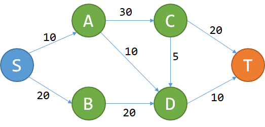

# 第六周
### 动态规划
#### 本质
将复杂问题分解成子问题，寻找其重复性；

#### 定义
多阶段决策问题中,各个阶段采取的决策,一般来说是与时间有关的,决策依赖于当前状态,又随即引起状态的转移,一个决策序列就是在变化的状态中产生出来的,故有“动态”的含义,称这种解决多阶段决策最优化问题的方法为动态规划方法

#### 相关概念
【无后效性】
- 一旦f(n)确定，“我们如何凑出f(n)”就再也用不着了。
- 要求出f(15)，只需要知道f(14),f(10),f(4)的值，而f(14),f(10),f(4)是如何算出来的，对之后的问题没有影响
- “未来与过去无关”，这就是无后效性。
- 严格定义：如果给定某一阶段的状态，则在这一阶段以后过程的发展不受这阶段以前各段状态的影响。

【最优子结构】
- 大问题的最优解可以由小问题的最优解推出，这个性质叫做“最优子结构性质”。

所以动态规划的推理即：能将大问题拆成几个小问题，且满足无后效性、最优子结构性质。

#### 典型应用
- DAG最短路
如图，求S-T的最少开销；

不难看出，f(T) = min (f(C)+20, f(D)+10);
也就是F(P) = min{F(D) + V (D->P)};

#### DP三连
我是谁？——设计状态，表示局面

我从哪里来？

我要到哪里去？ ——设计转移

#### 练习题
- [ ] 最长公共子序列
- [ ] 最长上升子序列
- [x] 零钱兑换
- [x] 最大子序列的和
- [x] 三角形最小路径和
- [x] 打家劫舍
- [x] 打家劫舍II
- [x] 打家劫舍III

#### 作业题
中等

- [x] 最小路径和
- [ ] 解码方法
- [ ] 最大正方形
- [ ] 任务调度器
- [ ] 回文子串

困难

- [ ] 最长有效括号
- [ ] 编辑距离
- [ ] 矩形区域内不超过k的最大数值和
- [ ] 青蛙过河
- [ ] 分割数组的最大值
- [ ] 学生出勤记录
- [ ] 最小覆盖子串
- [x] 戳气球
