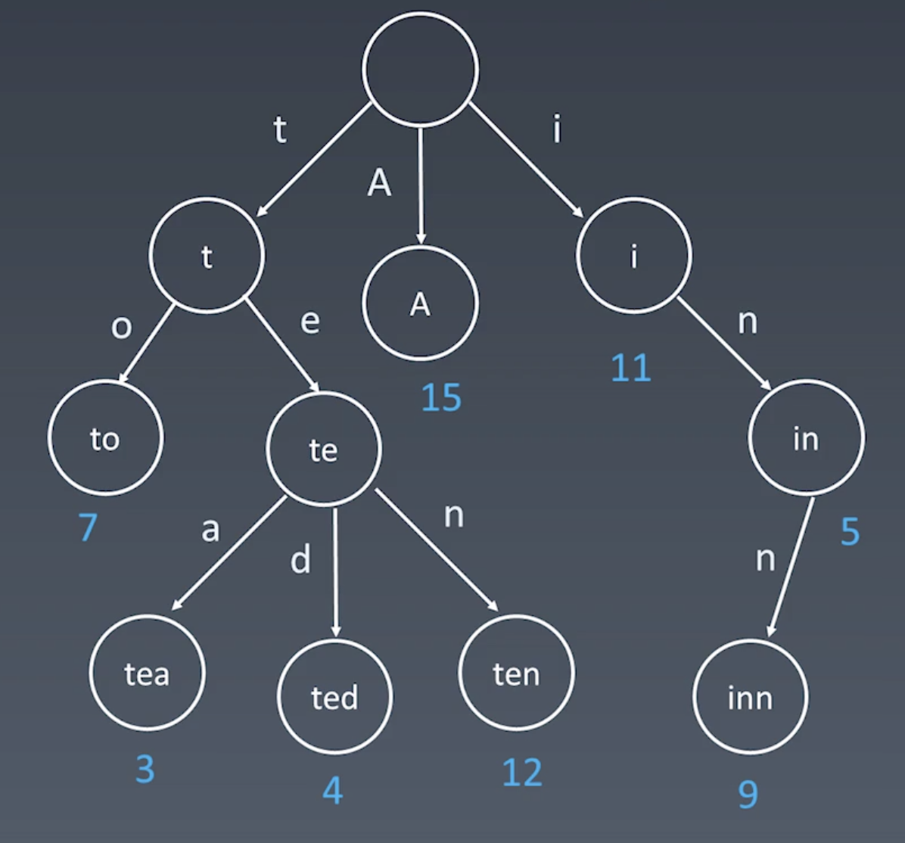
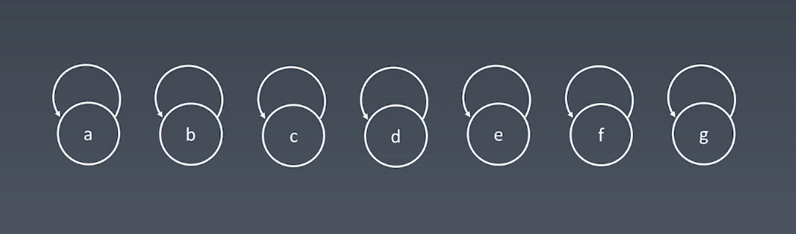

# 第七周
## 字典树

### 数据结构
#### 图示

#### 代码实现
```java
class Trie {
    private TreeNode root;
    public Trie() {this.root = new TreeNode();}
    public void insert(String word){/*...*/}
    public boolean search(String target){/*...*/}
    public boolean startWith(String prefix){/*...*/}

    class TreeNode {
        final int SIZE = 26;
        boolean isEnd;
        TreeNode[] childs; 
        public TreeNode() {
            this.isEnd = false;
            this.childs = new TreeNode[SIZE];
        }
    }
}
```
### 基本性质
1. 结点本身不存完整的单词
2. 根结点到某一结点经过的字符连接成对应字符串
3. 每个结点所有子结点代表的字符都不同
### 典型例题
- [x] 单词搜索II
- [x] 实现Trie前缀树

## 并查集
### 数据结构
#### 图示

#### 代码实现
```java
class Unions {
    private int count;
    private int[] parent;
    public Unions(int n) {
        count = n;
        parent = new int[n];
        for (int i = 0; i < n; i++) parent[i] = i;
    }
    public void union(int x, int y) {
        int rootX = find(x);
        int rootY = find(y);
        if (rootX == rootY) return;
        parent[rootX] = rootY;
        count--;
    }
    public int find(int x) {
        while (x != parent[x]) {
            parent[x] = parent[parent[x]]; //路径压缩
            x = parent[x];
        }
        return x;
    }
    public int count() { return count;}
}
```
#### 结构优化
1. 路径压缩
2. rank数组判断深度决定union方向（有路径压缩可省去）
### 基本操作
1. makeSets(n) 构造一个初始大小为n的并查集
2. union(x, y) 将x和y两个元素连接，即一个元素的root指向另一个元素的root
3. find(x) 找到某元素x的root
### 典型例题
- [x] 朋友圈
- [x] 岛屿问题

## 高级搜索
### dfs与bfs的剪枝
#### 特点与特性
1. 棋类常用剪枝
2. 在bfs与dfs的基础上，避免重复或者无意义访问的优化动作

#### 典型例题
- [x] 斐波那契
- [ ] 数独

### 双向bfs
#### 特点与特性

#### 代码模板
```java
class Model {
  public void model() {
    //1.init
    Set<String> visit = new HashSet<>(); //总的访问记录 保证每个节点只被访问一次
    //3. 用两个visit分别表示起始节点和目标节点发起的bfs待访问节点集合；
    Set beginVisit = new HashSet<>();
    beginVisit.add(begin);
    Set endVisit = new HashSet<>();
    endVisit.add(end);
    int step = 1; //初始路径数
    while (!beginVisit.isEmpty() && !endVisit.isEmpty()) {
      //判断beginvisit和endvisit的大小，取小的进行下探
      if (beginVisit.size() > endVisit.size()) {
          Set temp = beginVisit;
          beginVisit = endVisit;
          endVisit = temp;
      }
      Set newBeginVisit = new HashSet<>();
      for (Object obj : beginVisit)  {
        Object newObj = handle(obj); //处理obj得到图的下一个访问节点
        if (endVisit.contains(newObj)) return step+1;
        if (!visit.contains(newObj)) {
          newBeginVisit.add(newObj);
          visit.add(newObj);
        }
      }
      beginVisit = newBeginVisit;
      step++;
    }
    return 0; // 其中一个集合为空，begin和end未相遇，则路径无法到达；
  }
}
```
#### 典型例题
- [ ] 单词拼接
- [ ] 单词拼接II

### A*启发式搜索
#### 特点与特性
1. 利用优先队列，对待访问的元素进行特定的排序，优先访问某些元素，以提高整体效率
2. 启发式函数h(n)，它用来评价哪些节点最值得优先访问
#### 典型例题
- [ ] 二进制矩阵中的最短路径
- [ ] 滑动谜题

## 红黑树与AVL数
### AVL数
1. 自平衡的二叉搜索树
2. 存储额外的平衡因子k, int k = height(left) - height(right)
3. 通过自旋操作，保证每个结点的平衡因子均在（-1，0，1）中

### 红黑树
1. 近似平衡的二叉搜索树
2. 通过结点的红黑性质，保证左右子树高度差小于两倍
3. 根结点与叶子结点均为黑；
4. 红色结点不能有相邻
5. 结点到子树中所有叶子结点的路径包含相同的黑色节点

### 优劣比较
1. **红黑树有更好的插入和删除效率，因为是近似平衡，有更少的旋转操作**；且存储只需要额外1bit区分红黑；
2. **AVL树有更高的查询效率，因为是严格平衡的二叉树**；但需要额外存储高度int信息，空间消耗与维护成本较高

## 作业题
- [ ] 被围绕的区域
- [ ] 有效的数独
- [ ] 括号生成
- [ ] 单词接龙
- [ ] 最小基因变化
- [x] 单词搜索II
- [ ] N皇后
- [ ] 解数独
