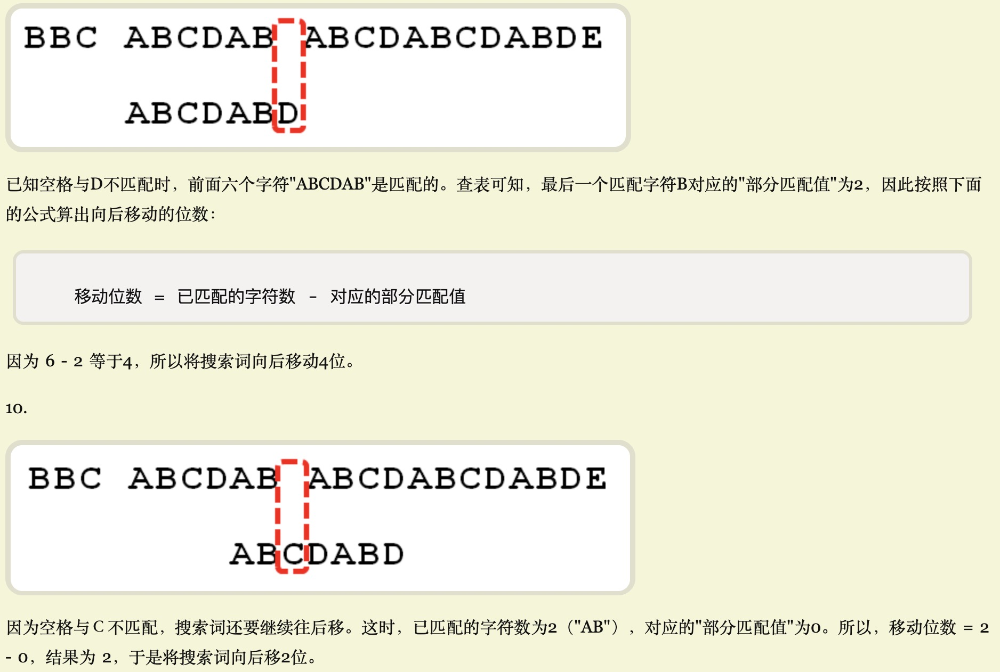

# 第九周
## 字符串匹配算法
### Rabin Karp RK算法
- 通过较好的hash函数，判断子串哈希是否相同；若相同再朴素算法一一匹配；
- 哈希函数利用滑动窗口，去头填尾来提升哈希效率（将滑动后的再哈希从O(m)降低到O(1)）；

### KMP算法
- 利用已知信息：pat字符串中出现的前缀串的匹配值；

- 动态地跳过部分确定不匹配的尝试步骤

### 本周作业
简单
- [ ] 字符串中的第一个唯一字符（亚马逊、微软、Facebook 在半年内面试中考过）
- [x] 反转字符串 II （亚马逊在半年内面试中考过）
- [x] 翻转字符串里的单词（微软、字节跳动、苹果在半年内面试中考过）
- [ ] 反转字符串中的单词 III （微软、字节跳动、华为在半年内面试中考过）
- [x] 仅仅反转字母（字节跳动在半年内面试中考过）
- [ ] 同构字符串（谷歌、亚马逊、微软在半年内面试中考过）
- [ ] 验证回文字符串 Ⅱ（Facebook 在半年内面试中常考）
中等

在学习总结中，写出不同路径 2 这道题目的状态转移方程。
- [x] 最长上升子序列（字节跳动、亚马逊、微软在半年内面试中考过）
- [x] 解码方法（字节跳动、亚马逊、Facebook 在半年内面试中考过）
- [x] 字符串转换整数 (atoi) （亚马逊、微软、Facebook 在半年内面试中考过）
- [ ] 找到字符串中所有字母异位词（Facebook 在半年内面试中常考）
- [x] 最长回文子串（亚马逊、字节跳动、华为在半年内面试中常考）
困难

- [x] 最长有效括号（亚马逊、字节跳动、华为在半年内面试中考过）
- [ ] 赛车（谷歌在半年内面试中考过）
- [ ] 通配符匹配（Facebook、微软、字节跳动在半年内面试中考过）
- [x] 不同的子序列（MathWorks 在半年内面试中考过）
